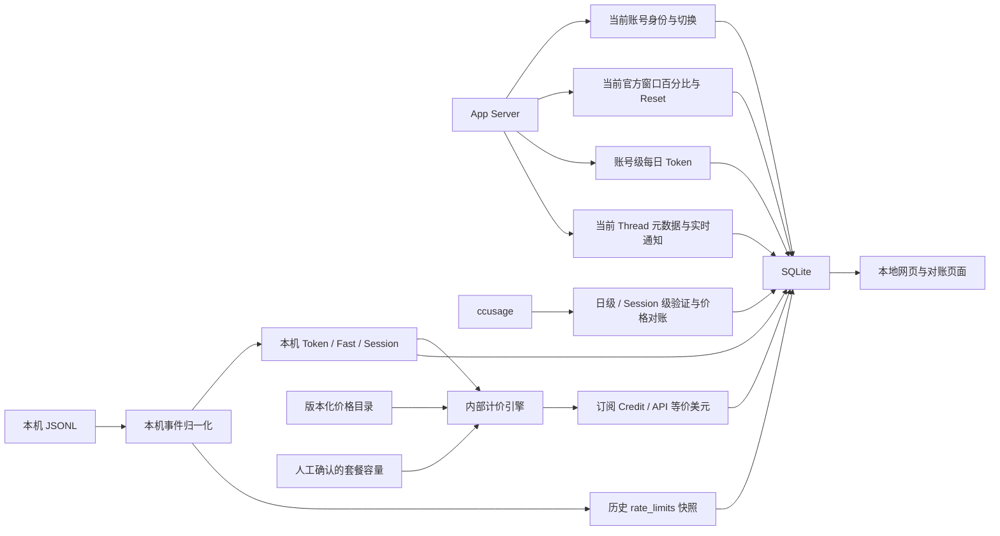

# 数据来源与职责边界参考

> 本文是 Codex Meter 执行阶段的数据来源参考。它补充并解释
> [最终执行计划](FINAL_EXECUTION_PLAN.md)，不替代数据库 schema、计算公式或验收标准。

## 1. 总体结论

下面这组三源划分整体正确：

```text
JSONL
├─ 本机 Token、模型、Fast、Session
└─ 历史官方窗口快照：百分比、Reset、limit、plan、可选 credits

App Server
├─ 当前账号身份与账号切换
├─ 当前官方窗口：百分比、Reset、limit
└─ 账号级每日 Token、当前 Thread 元数据和实时通知

ccusage
├─ 日级验证结果
├─ Session 级验证结果
└─ 模型、Token 分类、Fast、价格计算对账
```

需要补充四个边界：

1. `Credit` 不是上述任何接口直接提供的权威累计消耗值，而是系统根据本机 Token、模型、Fast、价格版本和人工确认的套餐容量计算出来的派生指标。
2. App Server 的账号每日 Token 是账号级、可能延迟的参考数据，不是本机 Token，也不是 Credit。
3. `ccusage` 不是全新的原始数据源；它主要重新读取 JSONL，并使用成熟的解析、去重、汇总和计价逻辑。因此它适合作为汇总/校验链，而不能独立证明官方窗口或订阅 Credit。
4. JSONL 中的 `rate_limits` 是历史时刻看到的账号窗口快照，只有在某些事件中才出现，不能保证连续采样。

## 2. 数据范围的三种口径

实现时必须把以下三种范围分开：

| 口径 | 代表数据 | 含义 |
| --- | --- | --- |
| 本机级 | JSONL Token、ccusage daily/session | 当前机器能够读取到的本地会话用量 |
| 账号级 | App Server rate limits、account usage | 当前认证账号的总状态，可能包含其他机器 |
| 派生级 | Credit、API 等价美元、本机窗口占比、校准值 | 系统计算或人工配置的结果，不是原始接口字段 |

因此“官方窗口下降了多少”和“本机估算用了多少”必须分别保存。两者可以对账，但不能直接当作同一条曲线。

## 3. JSONL：本机精细事件主源

### 3.1 能提供的数据

主要路径是：

```text
~/.codex/sessions/**/*.jsonl
~/.codex/archived_sessions/**/*.jsonl
```

应从结构化白名单事件中抽取：

- `token_count`：累计 Token、最近一次增量 Token，以及输入、缓存读取、缓存写入、输出、推理输出、总 Token。
- 时间戳、Session ID、Thread ID、Turn ID、模型和上下文窗口。
- `thread_settings_applied`、`turn_context`：服务等级或 Fast/Standard 状态变化。
- `session_meta`、任务开始/结束、父子线程、fork/replay 等归因信息。
- `rate_limits`：当时响应中附带的 primary/secondary、`used_percent`、窗口时长、`resets_at`、limit ID、plan 和可选 credits 字段。

JSONL 是分钟级趋势和本机 Session 级归因的主要事实来源。它是事件驱动的稀疏记录，不需要依赖高频轮询；每个 Token 事件到达时即可推进本机用量。

### 3.2 计算时的注意事项

- `total_token_usage` 通常是累计计数，`last_token_usage` 通常是最近增量；二者必须根据事件类型选择，不能无条件相加。
- 必须处理重复写入、文件重读、Session fork、replay、父子线程和计数器重置。
- 同一 Thread 内 Fast 可以开、关、再开、再关；Fast 必须按事件时间继承，不能给整个 Session 固定一个值。
- 缓存读取属于总输入的一部分；`reasoning_output_tokens` 属于输出的子集，不能重复相加。
- 启动时要扫描 active 和 archived 两个目录；只读 active sessions 会漏掉历史归档数据。

### 3.3 JSONL 的限制

JSONL 是本机日志，不是完整的账号档案：

- 不可靠地提供 ChatGPT 邮箱、稳定账号 ID、`authMode`、API Key 标识或历史完整 `base_url`。
- 无法仅凭 `model_provider` 严格区分官方 API、第三方 API 和 ChatGPT 登录。
- `model_provider=pro` 且 `plan_type` 为空不能自动解释为 Pro 套餐；当前用户样本已经人工确认这类记录属于 `Other/API`，应保存人工映射和时间范围。
- JSONL 中的百分比和 Reset 是当时记录到的账号状态，不代表该百分比全部由本机消耗造成。
- JSONL 不提供订阅窗口的累计 Credit 消耗和 20/100/200 套餐的官方总容量。

## 4. 本地辅助文件：归因和配置补充源

这些文件不是 Token 账本，但可能对展示和归因有价值：

| 文件/配置 | 可补充的数据 | 是否作为用量主源 |
| --- | --- | --- |
| `state_5.sqlite` | Thread 标题、工作目录、模型/推理设置、rollout 路径、线程关系 | 否 |
| `session_index.jsonl` | Session 索引和名称 | 否 |
| `config.toml`、`CODEX_HOME` | 日志根目录、Provider、默认模型和当前配置 | 否 |

执行时要明确选择：使用这些文件补充 Thread 展示和关系，还是有意不依赖它们。如果不使用，也要保留这个决定，避免实现者不清楚标题、Session 关系和路径来自哪里。

## 5. App Server：当前账号和官方控制面

### 5.1 账号身份

通过 `account/read`、`account/updated` 和账号变化事件，可以获得或推断：

- 当前认证类型：ChatGPT、API Key、Bedrock 等。
- 当前账号邮箱或脱敏身份标识（如果接口返回）。
- 当前 `planType`，例如 Plus、Pro 或其他套餐。
- 账号切换和认证状态变化。

这些数据描述“当前时刻的账号”。采集器应保存上下文区间，例如半开区间 `[start_at, end_at)`，不能把当前账号身份回填到全部历史日志。

### 5.2 官方窗口

通过 `account/rateLimits/read`、`account/rateLimits/updated` 可以获得：

- 一个或多个官方限制桶和 `limit_id`。
- primary/secondary 的 `used_percent`、窗口时长、Reset 时间。
- 套餐类型、是否触达限制及相关状态。

这是官方账号级窗口状态，适合绘制“窗口剩余百分比”和 Reset 标记。它不是本机用量，也不能直接拆出两台机器各自消耗的百分比。

### 5.3 Credit 相关字段的边界

接口可能出现 `credits.balance`、`has_credits`、`unlimited` 或 `rateLimitResetCredits` 等字段，但它们不能直接解释为：

- 本周订阅总 Credit；
- 当前已经消费的订阅 Credit；
- 20/100/200 美元套餐对应的窗口容量。

`rateLimitResetCredits` 更接近重置券/重置能力；`credits.balance` 是另一个 Credit 余额概念。它们必须单独保存，不能写入系统的 `estimated_subscription_credit`。

### 5.4 账号每日 Token

`account/usage/read` 可以提供：

- `lifetimeTokens`；
- `peakDailyTokens`；
- 最长任务、连续使用天数等画像数据；
- `dailyUsageBuckets`，即账号按日 Token。

这组数据对应 Codex 个人资料页的 Token 活动。它是账号总量，可能包含其他机器，且当前日期可能延迟或暂时没有 bucket。它可以用来和本机 JSONL Token 对照，估算未观测部分，但不能用于本机 Credit、Fast 拆分或实时窗口计算。

当前系统按本机 `Asia/Shanghai` 展示日期，同时保存 App Server 原始 `startDate`、读取时间和结算状态。远程 bucket 的服务端时区没有稳定公开契约，因此该维度必须标记为参考。

### 5.5 Thread 相关接口和通知

`thread/list`、`thread/read` 和 `thread/tokenUsage/updated` 可补充：

- Thread 标题和元数据；
- 当前活动 Thread 的 Token 总量和最近增量；
- 当前上下文窗口。

它们适合实时界面和 Thread 元数据，但不是完整历史账本。最终历史 Token 仍以 JSONL 回放为准；Thread Token 通知不应和 JSONL Token 再次相加。

## 6. ccusage：成熟汇总和校验链

`ccusage` 主要读取同一批 Codex JSONL，因此它不是第三个独立的官方账单源，而是第二套成熟计算实现。

它适合提供：

- 日级 Token 汇总；
- Session 级 Token 汇总；
- 模型和 Token 分类；
- 非缓存输入、Cache Read、输出、推理输出等字段；
- Fast/Standard 或自动 Fast 计价差异；
- 模型价格、长上下文和缓存规则下的 API 等价美元；
- 去重、累计 Token 转增量、Session/replay 处理后的对账结果。

使用时要注意：

- 以 `totalTokens` 对比账号 Token，不能只拿 `inputTokens` 对比。
- `inputTokens` 通常是非缓存输入，`cacheReadTokens` 需要单独计入总 Token。
- `reasoningOutputTokens` 是输出子集，不能再额外加一次。
- `ccusage` 的 `costUSD` 是价格模型下的 API 等价估算，不是订阅官方扣款，也不是官方 Credit。
- 如果系统需要分钟级窗口曲线，内部仍需保留 JSONL 原始事件和增量计算；不能只保存 ccusage 的日汇总。

建议将 `ccusage` 结果保存为独立的 `validation` 数据，并记录版本、参数、时间范围、时区、价格版本和结果哈希。

## 7. 价格和人工配置：计算所需的外部输入

### 7.1 价格目录

价格不是从 JSONL 或 App Server 自动得到的完整历史账单。系统需要维护版本化价格目录，至少包含：

- 模型和价格类别；
- 输入、缓存读取、缓存写入、输出、推理等价格；
- Fast/Standard 倍率；
- 长上下文规则；
- `effective_from`、`effective_to` 和时区；
- 来源、版本、确认时间和是否人工覆盖。

历史事件按事件时间选择价格版本。新价格不能覆盖旧日期的计算结果；价格变化日必须按固定的生效时间保存。

### 7.2 套餐容量和机器配置

20、100、200 美元套餐的窗口容量不是自动读取值，应由用户在管理页手工确认并保存版本：

- 当前机器使用哪个 `capacity_profile`；
- 20/100/200 各自确认的总容量 Credit；
- 生效时间和确认备注；
- 后续是否被人工修订。

`plan_type=plus/pro`、认证类型和本地 `capacity_profile` 必须是三个独立字段。不能因为识别到 Pro 就自动选择 100 或 200 美元容量。

## 8. 关键指标与唯一推荐来源

| 最终指标 | 推荐来源 | 计算/展示边界 |
| --- | --- | --- |
| 本机分钟级 Token | JSONL | 事件回放、去重、累计转增量 |
| 本机日级/Session Token | JSONL + ccusage 对账 | 以 `totalTokens` 为总量基准 |
| 本机 API 等价美元 | 内部价格引擎 + ccusage 校验 | 按历史价格版本计算，不代表实际账单 |
| 本机订阅 Credit | 内部订阅计价引擎 | 模型、Token、Fast、长上下文、订阅价格方案 |
| 官方账号窗口百分比 | App Server 当前值；JSONL 历史快照 | 账号级，不宣称是本机占比 |
| 账号每日 Token | App Server `account/usage/read` | 账号级、延迟参考，不参与 Credit |
| 本机占账号 Token 比例 | 本机 JSONL / 账号每日 Token | 仅对已结算、同账号、可比较日期计算 |
| Thread 标题和关系 | JSONL + 本地辅助文件/App Server | 只做展示和归因，不重复计 Token |
| 20/100/200 窗口容量 | 人工确认配置 | 作为百分比分母，版本化保存 |

## 9. 账号与历史分类规则

历史和未来记录都要分别保存：

```text
auth_kind          = chatgpt | official_api | custom_api | bedrock | unknown
plan_type_raw      = plus | pro | other | null
display_group      = plus | pro | other_api | other | unknown
capacity_profile   = usd20 | usd100 | usd200 | null
provider_name      = 原始 provider 名
classification_source = observed | manual | inferred | unknown
```

当前用户已经确认的规则是：

- `plan_type=plus`：Plus；
- `plan_type=pro`：Pro；
- `model_provider=pro` 且没有 `plan_type`：不能判定为 Pro，按当前历史人工映射归入 `Other/API`；
- 无充分证据的旧记录保留 `unknown`，不要强行归类；
- 未来通过 App Server 的认证状态、账号身份和 provider 变化建立上下文区间。

历史 JSONL 通常不能严格区分官方 API 与修改过 Base URL 的第三方兼容 API，因此需要人工 provider 映射或未来采集脱敏 endpoint 指纹。绝不保存 API Key、认证 Token 或完整请求头。

## 10. 对执行计划的直接要求

执行者应至少保证以下内容没有被简化掉：

1. JSONL 同时扫描 active 和 archived 目录。
2. JSONL 原始观察先入库，派生 Credit、美元和百分比后计算。
3. App Server 身份、官方窗口、账号每日 Token分别存储，不合并成一个 `credit` 字段。
4. App Server 账号每日 Token保存读取时间、原始日期和延迟/结算状态。
5. `ccusage`只作为独立校验和日级/Session汇总，不能替代分钟级 JSONL 事件账本。
6. 所有价格和套餐容量都带版本和生效时间。
7. `model_provider`、`plan_type`、`auth_kind`、`capacity_profile`分别保留。
8. 当前线程 Token 通知不与 JSONL 重复计数。
9. 日级本机 Token、账号级每日 Token、官方窗口百分比在界面上明确标记作用域和数据质量。
10. `codex-usage-report.sh`若继续保留，只作为历史结果校验工具，不作为新的权威数据源。

## 11. 最终职责图



一句话总结：

> JSONL 负责“本机发生了什么”；App Server 负责“账号当前的官方状态是什么”；ccusage 负责“用成熟实现把本机历史重新汇总并校验”；价格和套餐容量负责“如何把本机 Token 换算成 Credit 和美元”。

