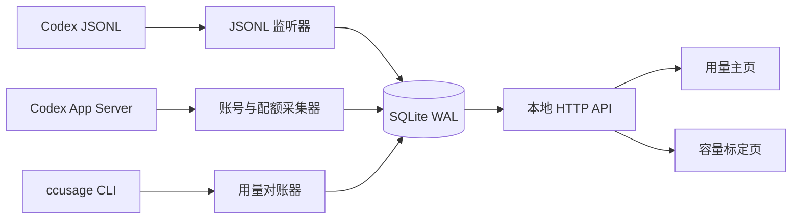

# 最终设计

## 0. 已验证的指标口径

本节记录截至 2026-08-04 已用真实本机数据核对过的结论，避免实现时把“账号 Token”“本机 Token”“API 美元估算”和“订阅窗口百分比”混成一个指标。

### 0.1 个人资料页与 App Server 是同一组账号数据

个人资料页的每日 Token 活动与 App Server `account/usage/read.dailyUsageBuckets` 对应。页面只是做了单位格式化和四舍五入：

| 页面显示 | App Server 原始值 | 说明 |
| --- | ---: | --- |
| 7 月 14 日约 1.8 亿 | `176,218,402` | 同一账号每日 bucket |
| 7 月 23 日约 1.7 亿 | `173,830,632` | 同一账号每日 bucket |
| 7 月 28 日约 8699.5 万 | `86,995,281` | 同一账号每日 bucket |
| 7 月 29 日约 1.4 亿 | `136,823,097` | 同一账号每日 bucket |
| 累计约 6.4 亿 | `641,414,607` | `lifetimeTokens`；每日 bucket 相加与之相等 |

这个接口表示当前认证账号的账号级活动，不表示当前机器独占用量。它没有机器 ID，也没有按模型、Fast、Credit 或 API provider 拆分；同一账号在其他机器或其他 Codex 界面的活动可能包含在内。API Key/第三方 API 的本机日志也不保证进入该账号画像。

### 0.2 本机 JSONL/ccusage 的对账字段

本机 JSONL 和 `ccusage` 对账时必须使用 `totalTokens`，不能把 `Input` 单独拿去和个人资料页的总 Token 比较。

```text
totalTokens = 非缓存输入 + Cache Read + 输出
```

`ccusage` JSON 中的 `inputTokens` 是扣除缓存后的非缓存输入，`cacheReadTokens` 单独列出；缓存 Token 是输入的一部分，不应再次重复相加；`reasoningOutputTokens` 是输出 Token 的子项，也不能再加一次。

真实样本中：

```text
2026-08-03 本机 totalTokens       = 22,896,275
2026-08-03 App Server account     = 23,656,913
差异                                  ≈ 3.2%

2026-07-14 本机 totalTokens       = 178,445,693
其中登录 Token                     = 173,490,735
其中其他/未确认来源                 =   4,954,958
2026-07-14 App Server account     = 176,218,402
```

因此 7 月 14 日和 8 月 3 日的原始 Token 量是同量级且基本对齐的。若某日期差异达到数量级，优先检查：比较的是否是 `Input` 而非 `totalTokens`、本机是否混入 `plan_type` 缺失的 API/第三方日志、账号是否在其他机器使用，以及 App Server bucket 是否已经结算。

### 0.3 周窗口百分比：官方为准，本机为估算

本机脚本中的周窗口百分比是估算值，不是 App Server 官方窗口百分比。当前实现使用
真实 Credit 计算：本机窗口 Credit 累计 ÷ 人工确认的周容量（`capacities`），
页面同时展示官方窗口百分比（来自 App Server/JSONL quota 采样）与本机估算占比，
两者分栏展示、不互相覆盖。早期原型使用的“登录 Token × 经验倍率 ÷ 假定容量”
公式已废弃，不再作为计算依据。

### 0.4 实现原则

- JSONL：本机事件级事实源，负责 Token、模型、Fast/Standard、账号上下文和分钟级趋势。
- `ccusage`：不修改源码的本机汇总/去重/价格计算器，负责日级和 session 级对账；其 `totalTokens` 作为本机 Token 汇总基准。
- App Server：账号身份、官方当前配额百分比、reset 和账号级每日 Token 参考源。
- 人工容量：20/100/200 美元档的周容量必须人工确认并版本化保存。
- 历史价格：按事件时间选择带生效时间的价格版本，不能用今天的价格回写全部历史。
- Credit、API 等价美元、账号 Token、本机 Token、官方窗口百分比必须在数据库和界面中分栏保存、分栏展示。

## 1. 产品边界

Codex Meter 是单机本地服务。每台机器只统计自己能读取到的 JSONL，不接收其他机器数据，也不尝试推断其他机器的 token 明细。

当前实际账号场景：

- Plus 20 美元账号固定在一台机器，适合做高可信容量标定。
- Pro 200 美元账号在两台机器使用，其中一台无法取数。页面必须明确区分“账号总窗口下降”和“本机估算消耗”，差值只能标记为其他机器/误差，不能伪装成本机用量。
- 数据模型同时支持人工维护 20/100/200 美元三个容量档位，即使当前没有 100 美元账号。

## 2. 总体架构



单一后台进程负责：

- 维护一个 App Server 子进程和通知流。
- 监听 JSONL 文件变化。
- 调用已安装的 `ccusage`，读取 JSON，不修改其源码。
- 将原始快照、归因区间、计算结果和人工确认值写入 SQLite。
- 在 `127.0.0.1` 提供网页与 API。

不保存提示词、回复正文、API Key 或认证 token。

## 3. 采集策略与频率

### 3.1 JSONL

- 使用文件系统事件监听，2 秒 debounce。
- 只读取新增字节，保存每个文件的 inode/路径、offset、mtime 和最后一行校验值。
- 新 `token_count`、`thread_settings_applied`、`session_meta` 立即入库。
- 启动时扫描 active 与 archived 两个目录，并按 session ID 去重。
- 每 6 小时做一次完整一致性检查；文件被归档或重写时重新建立 offset。

JSONL 的本地精度接近事件级，不依赖 1 分钟轮询。采集器不保存消息正文，只抽取白名单字段。

### 3.2 App Server

- 长连接接收 `account/updated`、`account/rateLimits/updated` 和 `thread/tokenUsage/updated`。
- 启动、重连、账号变化时立即执行 `account/read` 与 `account/rateLimits/read`。
- Codex 活跃时每 60 秒做一次配额兜底读取；空闲时每 5 分钟一次。
- `account/usage/read` 只在启动/重连、每 6 小时和本机日期跨天后读取；失败采用指数退避，最多退到 24 小时，不把它当作实时计数器。
- 重置时间前后各额外采一次：`T-60s`、`T+15s`、`T+60s`。
- 账号每日 Token 的最新 bucket 可能滞后甚至暂时缺失；原始 `startDate` 原样保存，派生比较日期按 `machines.timezone`（当前 `Asia/Shanghai`）对齐，并标记 `pending/stale/settled`。

配额百分比目前是整数，10 秒级轮询不会增加可见精度，只会制造重复样本；60 秒是精度与开销的平衡点。

### 3.3 Token 参考维度

- 本机 Token 来自 JSONL 去重增量，账号 Token 来自 `account/usage/read.dailyUsageBuckets`。
- 账号每日 Token 可能跨机器，但没有模型、Fast、价格和 Credit 拆分；只用于历史核对和“未观测 Token”参考。
- 只有已结算日期、同一账号且没有 API/账号混杂时，才计算 `max(account_tokens - local_tokens, 0)` 和本机覆盖率；当前日期不把缺失 bucket 当作 0。
- 该维度不参与 Credit、周窗口占比、容量自动确认或价格回填；详情见 [数据来源参考的 Token 参考维度](DATA_SOURCE_REFERENCE.md)。

### 3.4 ccusage

- JSONL 有变化后 10 秒 debounce，最多每 60 秒执行一次 session JSON 汇总。
- 核心订阅 Credit 每次执行两套模式：自动识别 Fast、强制 Standard。
- API 等价美元使用独立价格方案；活跃期按较低频率执行自动/Standard 两套结果，不能直接复用订阅 Credit 的 `costUSD`。
- 账号切换通知到达时强制执行一次切换前/后的检查点。
- 启动、每天 00:05、每 6 小时执行完整对账。
- 无 JSONL 变化时不高频重复扫描。

同一价格方案下两次汇总的差值给出 Fast 附加量。每个 session 快照与上次快照做差，得到通常不超过约 60 秒的本机用量增量，并归入当时有效的账号上下文。若一次增量跨越账号切换边界且无法用检查点切开，必须标记 `mixed_account`，不能假装精确。

`ccusage` 扫描成本随历史文件增长。触发间隔采用 `max(60 秒, 上次运行耗时 × 10)`，账号切换和 reset 检查点不受此退避限制；完整 API 美元等价重算可每 5 分钟或日汇总时执行。

## 4. 账号上下文与历史归因

每个时刻只允许一个有效的 `account_context_interval`：

```text
[start_at, end_at)
auth_kind: chatgpt | official_api | custom_api | bedrock | unknown
plan_type_raw: plus | pro | ... | null
display_group: plus | pro | other_api | other | unknown
capacity_profile: usd20 | usd100 | usd200 | null
provider_name
endpoint_fingerprint
identity_fingerprint
classification_source: observed | inferred | manual | unknown
```

未来归因：

1. App Server 的 `account/read` 与 `account/updated` 决定 ChatGPT/API 登录方式；`plan_type_raw=plus/pro` 分别归入 Plus/Pro。
2. ChatGPT 邮箱规范化后做本地 HMAC，作为身份指纹；界面只显示脱敏邮箱。
3. API 模式没有稳定账号 ID时，使用 provider 名、脱敏 endpoint 和认证类型组合成“配置身份”，允许人工命名。
4. provider 或账号发生变化时关闭旧区间、开启新区间，并立即做 ccusage 检查点。
5. `capacity_profile` 永远由用户明确选择或确认，不由 `plan_type_raw` 自动推断 100/200 美元档。

历史回填：

- `plan_type_raw=plus/pro` 的事件分别按 ChatGPT Plus/Pro 归类。
- 本机已确认的 `model_provider=pro + plan_type_raw=null` 通过人工规则归入 `Other/API`。
- 其他自定义 provider 通过人工时间映射归类。
- 同一个 session 跨越身份切换而又没有事件证据时，拆成“可归因”和“未知”两段；不把整段强行归给某个账号。
- 允许用户在管理页添加历史区间标注，所有人工修订保留审计记录。

## 5. SQLite 数据模型

所有时间同时保存 UTC epoch 毫秒；展示按 `machines.timezone`，当前默认 `Asia/Shanghai`。建议表如下：

| 表 | 关键字段 | 用途 |
| --- | --- | --- |
| `machines` | `id`, `name`, `install_id`, `timezone` | 本机身份 |
| `account_identities` | `id`, `kind`, `email_masked`, `identity_hmac`, `label` | ChatGPT/API 身份 |
| `account_context_intervals` | `start_at`, `end_at`, `account_id`, `auth_kind`, `plan_type_raw`, `display_group`, `capacity_profile`, `provider`, `endpoint_hmac`, `classification_source` | 某段时间使用哪个账号/套餐/provider |
| `jsonl_files` | `path`, `session_id`, `inode`, `offset`, `mtime`, `digest` | 增量读取与归档去重 |
| `token_observations` | `session_id`, `turn_id`, `observed_at`, token 各字段, `model`, `service_tier`, `source_digest` | 白名单化本机 token 事件 |
| `quota_snapshots` | `observed_at`, `account_id`, `limit_id`, `used_percent`, `window_mins`, `resets_at`, `plan_type`, Credit 余额字段, `source` | 账号总窗口曲线 |
| `account_usage_snapshots` | `observed_at`, `account_id`, `lifetime_tokens`, `peak_daily_tokens`, `daily_buckets_json`, `alignment_timezone`, `freshness`, `source_status` | 账号级 Token 原始快照 |
| `token_reference_daily` | `local_date`, `account_id`, `account_tokens`, `local_tokens`, `unobserved_tokens`, `coverage_ratio`, `freshness`, `quality`, `source_snapshot_ids` | 本机与账号 Token 的非权威对账 |
| `ccusage_session_snapshots` | `observed_at`, `session_id`, 模型 token JSON, `pricing_scheme`, `auto_amount`, `standard_amount`, `pricing_version`, `ccusage_version` | 黑盒计算快照 |
| `usage_deltas` | `start_at`, `end_at`, `account_context_id`, token 各字段, `subscription_base_credit`, `subscription_fast_surcharge`, `subscription_total_credit`, `api_base_usd`, `api_fast_surcharge_usd`, `api_total_usd`, `quality` | 本机最小可计价增量 |
| `daily_rollups` | `local_date`, `account_id`, token 各字段, Credit/美元, `quality` | 首页日历与趋势；不混入账号级 Token |
| `pricing_versions` | `id`, `scheme`, `effective_at`, `timezone`, rates JSON, fast multipliers, `source_url`, `source_precision` | 订阅 Credit/API 美元两类带生效时间的不可变价格版本 |
| `plan_capacities` | `plan_code`, `effective_from`, `effective_to`, `confirmed_credit`, `status`, `note` | 人工确认的 20/100/200 周容量 |
| `calibration_segments` | 时间范围, 配额变化, 本机 Credit, 推算容量, 污染标记, 是否采纳 | 容量标定证据 |
| `manual_annotations` | target, before/after JSON, reason, created_at | 人工修订审计 |
| `collector_runs` | source, started_at, duration, status, stderr 摘要 | 健康检查与排错 |

数据库采用 WAL、外键和 schema migration。原始 JSONL 保留在 Codex 自己目录，系统数据库不复制对话正文。

## 6. Credit、美元与百分比计算

### 6.1 两套价格方案

系统同时维护：

- `subscription_credit`：按 Codex 订阅 rate card 折算 Credit，Fast 使用登录订阅对应倍率。
- `api_usd_equivalent`：按 API 美元价格折算等价账单，Fast 使用 API 对应倍率。

两套方案的单位、价格和 Fast 倍率独立。`ccusage` JSON 中字段名即使叫 `costUSD`，在加载 Credit override 时也只能解释为“计算数值”，必须由 `pricing_scheme` 决定最终单位。

### 6.2 本机标准 Credit

对每个模型和价格版本：

```text
standard_credit =
  non_cached_input_tokens / 1_000_000 * input_rate
  + cached_input_tokens / 1_000_000 * cached_input_rate
  + output_tokens / 1_000_000 * output_rate
```

长上下文按 `ccusage` 已实现的模型阈值和价格计算。推理 token 已包含在输出计费语义中时，不重复收费；页面仍单独展示推理 token。

### 6.3 Fast

```text
scheme_total = ccusage(auto, scheme)
scheme_standard = ccusage(force-standard, scheme)
scheme_fast_surcharge = max(scheme_total - scheme_standard, 0)
```

订阅和 API 的 Fast 附加量分别做一次差分。Fast 倍率按模型、价格版本和方案保存，不能使用全局固定 1.5、2 或 2.5。无法从 JSONL 判断 Fast 的事件标记 `fast_unknown`，不应默认全部 Standard 或全部 Fast。

### 6.4 本机套餐占比

只有 `plan_capacities.status=confirmed` 才用于主页：

```text
本机周占比 = 当前窗口内本机 subscription_total_credit / 人工确认周容量 * 100%
本机日占比 = 当日 subscription_total_credit / 人工确认周容量 * 100%
```

API 模式显示 token 与 API 等价美元，不计算订阅 Credit 或订阅窗口占比。

### 6.5 账号总量与未观测量

App Server 返回 `usedPercent`，页面派生：

```text
账号剩余百分比 = 100% - usedPercent
账号本窗口新增消耗 = 当前 usedPercent - 重置后基线 usedPercent
未观测占比 = max(账号新增消耗 - 本机估算周占比, 0)
```

`未观测占比` 可能来自另一台机器、其他 Codex 界面、百分比取整、价格模型误差或采样缺口，名称必须保持“未观测/误差”，不能写成“其他机器精确用量”。

### 6.6 Token 参考对账

对已结算、可比较的本机日期单独计算：

```text
account_tokens(d) = account/usage/read.dailyUsageBuckets[d].tokens
local_tokens(d)   = 本机 JSONL 去重后的每日 Token
unobserved_tokens(d) = max(account_tokens(d) - local_tokens(d), 0)
coverage_ratio(d) = local_tokens(d) / account_tokens(d)
```

`unobserved_tokens` 只能解释为“本机之外的未观测 Token + 口径误差”，不能直接等同于另一台机器的用量。它不参与 `subscription_total_credit`、套餐占比或人工确认容量。远程 bucket 尚未稳定、身份不一致、本机混入第三方 API 或数据有缺口时，`coverage_ratio` 为 null，质量标记为 `incomparable`。

## 7. 容量标定

容量不自动覆盖人工确认值。系统只生成候选值：

```text
候选周容量 = 本机区间 Credit / (账号 usedPercent 增量 / 100)
```

标定页要求用户选择一个“这段时间只有本机使用该账号”的区间。单个 1% 跳变误差很大，因此：

- 优先使用跨度至少 10 个百分点的连续区间。
- 对多个检查点做稳健回归，不使用单一首尾点作为唯一证据。
- 显示中位数、离散程度、样本数和百分比量化误差区间。
- Plus 单机账号可标为高可信。
- Pro 共享账号默认标记“被其他机器污染”，除非用户确认该区间其他机器没有使用。
- 用户在页面顶部手工输入并保存 20/100/200 档最终值，候选值永不自动替换它。

容量版本带生效时间；未来官方套餐规则变化时新增一条，不覆盖历史。

## 8. 价格版本与生效时刻

价格按事件时间选择，不用“今天抓到的最新价格”重算全部历史。

所有生产计算固定使用 `ccusage --offline` 和项目生成的不可变 pricing override；联网更新价格只能生成待审的新版本，不能直接改变历史结果。

已固定的人工决策：

```text
America/Los_Angeles: 2026-08-01 00:00:00 PDT
UTC:                 2026-08-01 07:00:00Z
Asia/Shanghai:       2026-08-01 15:00:00 CST
```

这是按美国太平洋时间解释“7 月 31 日午夜/8 月 1 日零点”的项目口径，不声称是 OpenAI 官方公布到秒的生效时间。`source_precision` 记录为 `manual_boundary`。

当前确认的 Credit/百万 token 价格表：

| 模型 | 非缓存输入 | 缓存输入 | 输出 | Fast |
| --- | ---: | ---: | ---: | ---: |
| GPT-5.6 Luna | 5 | 0.5 | 30 | 2.5x |
| GPT-5.6 Terra | 50 | 5 | 300 | 2.5x |
| GPT-5.6 Sol | 125 | 12.5 | 750 | 2.5x |
| GPT-5.5 Codex | 125 | 12.5 | 750 | 2.5x |
| GPT-5.4 | 62.5 | 6.25 | 375 | 2x |
| GPT-5.4 mini | 18.75 | 1.875 | 113 | 按该版本配置 |

变更前至少保存独立旧版本；已知 Terra/Luna 旧价分别为 `62.5/6.25/375` 与 `25/2.5/150`，其余模型沿用当时已确认版本。正式实现时价格表必须由带来源和测试的配置文件加载，不把数值散落在业务代码中。

### 8.1 精确处理切换当天

`ccusage --since/--until` 是按日期过滤，不能单独切开北京时间 8 月 1 日 15:00。历史回填采用前缀快照差分，不修改 `ccusage`：

1. 在权限为 0700 的本地临时目录构造“截至边界”的 JSONL 前缀视图。
2. 用旧价格对前缀运行 `ccusage`，得到旧价部分。
3. 用新价格分别计算完整视图和前缀视图，两者差值是新价部分。
4. 完成后删除临时副本；若校验失败则将该日标为 `boundary_approximate`，不静默给出伪精确值。

未来价格变化在采集时直接按事件时间记入对应版本，不再需要临时切分。

## 9. 前端信息架构

### 9.1 页面一：本机用量

顶部固定信息：

- 当前脱敏账号、ChatGPT/API、套餐、provider。
- 官方账号周窗口：已用、剩余、重置倒计时。
- 人工确认容量与本机本窗口累计 Credit/占比。
- 数据新鲜度和质量状态。

主体延续现有截图的日历加趋势布局：

- 左侧月历：每天显示本机 Credit、API 等价美元、套餐占比和账号类型；颜色按本机占比，不按 token 数。
- 右侧主图用同一个 0–100% 纵轴显示三条线：账号剩余百分比、账号已用百分比、本机估算累计百分比。
- 对共享 Pro 账号增加灰色区域/虚线：账号已用减本机估算，标记“未观测/误差”。
- 在日详情和趋势图下方增加 Token 参考条：本机 Token、账号 Token、未观测 Token/覆盖率及 `pending/stale/settled` 状态；固定显示“参考维度，不参与 Credit 百分比”。
- Reset 发生时开启新的窗口分段，图上画垂直线，不把曲线跨窗口相连。
- 页面右上套餐切换仅用于情景比较；默认值来自当时账号上下文，切换后明确标注“假设按另一套餐容量”。

点击某一天后，下方展开而非另开页面：

- token：非缓存输入、缓存输入、输出、推理、总量。
- 模型拆分。
- Standard Credit、Fast 附加 Credit、总 Credit、API 等价美元。
- 当日涉及的账号/套餐/provider 区间。
- 配额采样点、数据缺口、归因置信度和价格版本。

### 9.2 页面二：容量标定与管理

该页面把“观察”和“确认”分开：

- 顶部是 20/100/200 三档人工确认值、版本、生效日期和保存按钮。
- 中部选择账号、配额窗口和候选时间区间，并标记该区间是否只有本机使用。
- 主图上层显示账号 `usedPercent` 阶梯线，下层显示本机累计 Credit；刷选任意区间后即时计算候选容量。
- 右侧证据面板显示首尾百分比、百分比差、本机 Credit、Fast 附加量、样本数、缺口、污染风险和候选容量区间。
- 下方列出历史标定段，可“采纳为草稿”，但必须再由人点击保存为 `confirmed`。

这两个页面使用同一批底层数据，但目的不同：主页回答“本机现在用了多少”，标定页回答“周窗口容量应该取多少”。不需要复制两套图表逻辑。

### 9.3 页面三：设置与诊断

虽然核心业务是两个页面，仍需要一个轻量设置抽屉或诊断页：

- 本机名称、时区、ccusage 路径。
- 历史 provider 到账号类型的人工映射。
- 脱敏账号列表与当前上下文。
- 采集器健康、最近错误、JSONL offset、App Server 连接状态。
- 数据导出、数据库备份和重新对账。

## 10. 数据质量等级

每个日汇总和区间必须带质量标签：

- `exact`：事件、账号上下文、价格和 Fast 均明确。
- `estimated`：有完整 token，但账号容量或配额百分比有取整误差。
- `mixed_account`：区间跨账号且只能部分拆分。
- `unknown_provider`：无法判断官方/第三方 API。
- `boundary_approximate`：价格切换边界无法精确拆分。
- `missing_samples`：配额或 JSONL 有采样缺口。
- `fast_unknown`：该段 token 无法确认 Standard/Fast。
- `account_usage_pending`：账号级每日 Token 尚未出现或未结算。
- `account_usage_stale`：账号级每日 Token 可能仍在后台补写。
- `token_reference`：本机与账号 Token 对账，仅供参考。
- `incomparable`：身份、时区、认证类型或采集完整性不满足对比条件。

前端显示标签和原因，计算结果保留更多小数，展示时再格式化。

## 11. 技术选型

- 后端：Rust 单进程，便于长期运行、调用 `ccusage`、管理 App Server 和文件监听。
- 数据库：SQLite + WAL。
- HTTP：仅绑定 `127.0.0.1`，默认随机或可配置端口。
- 前端：React + TypeScript + Vite，静态资源嵌入后端二进制；图表用支持阶梯线、区间刷选和双层联动的成熟库。
- 进程管理：macOS 使用 launchd，应用提供 install/status/uninstall 命令。

第一版不做云同步、多机合并、远程访问、自动修改 Codex 配置或自动认定套餐容量。

本地写接口仍需校验 `Origin`、禁用通配 CORS，并使用启动时生成的 session/CSRF token；仅绑定 loopback 不能阻止恶意网页向本机服务发请求。App Server 的稀疏 `account/rateLimits/updated` 通知只能合并到上一份完整快照，字段缺失不能解释为清空；无法安全合并时立即重新读取完整快照。
